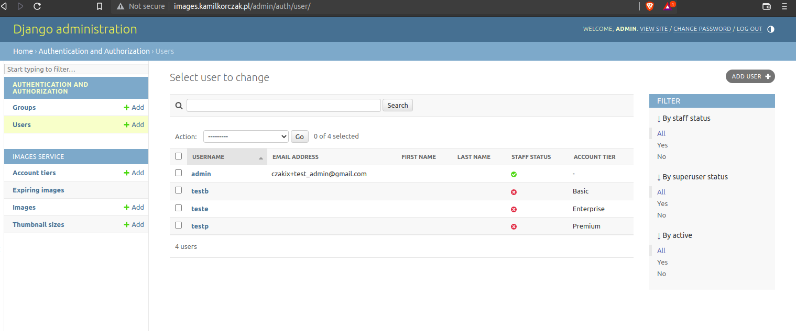
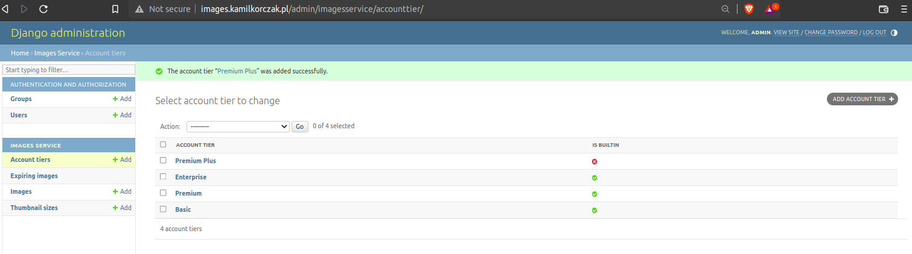
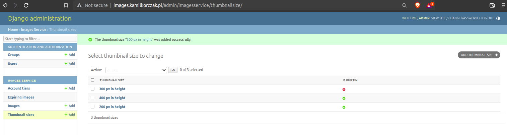
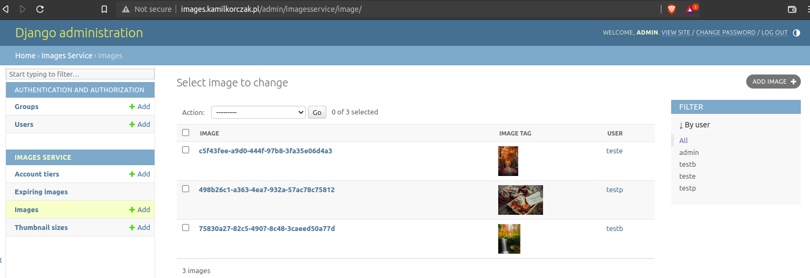
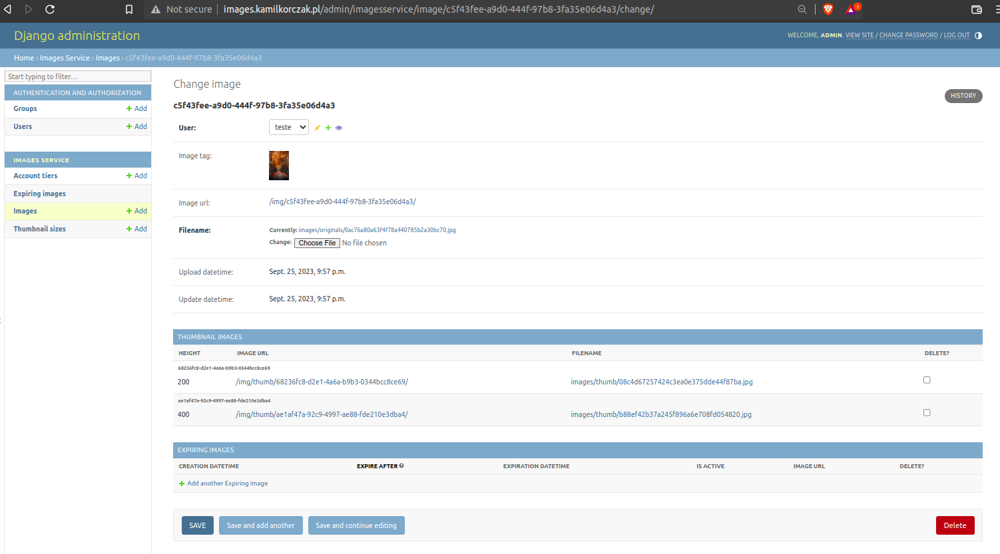

# Images Service

## Features
- project ready to run in docker-compose
- users are able to list their images
- there are three bult-in account tiers: 
    - Basic 
    - Premium
    - and Enterprise
- features of built-in account tiers:    
    - users that have "Basic" plan after uploading an image get:
        - a link to a thumbnail that's 200px in height
    - users that have "Premium" plan get:
        - a link to a thumbnail that's 200px in height
        - a link to a thumbnail that's 400px in height
        - a link to the originally uploaded image
    - users that have "Enterprise" plan get
        - a link to a thumbnail that's 200px in height
        - a link to a thumbnail that's 400px in height
        - a link to the originally uploaded image
        - ability to fetch an expiring link to the image (the link expires after a given number of seconds (the user can specify any number between 300 and 30000))
- apart from the builtin tiers, admins are able to create arbitrary tiers with the following things configurable:
    - arbitrary thumbnail sizes
    - presence of the link to the originally uploaded file
    - ability to generate expiring links
- admin UI is done via django-admin 
- no custom user UI (just browsable API from Django Rest Framework)

### Additionally
-  users can't access: images, thumbs, expiring images if account tier of image owner has no features enabled (even after images was created before his account was downgraded):
    - e.g. user upload image using Premium account, so he has access to image_url, if his account tier is downgraded to Basic, he has no longer access to this image, only thumbs with a height associated with account tier

## API endpoints 
- `/api/` - root
- `/api/images/` - all images; methods: `[GET, POST]`
- `/api/images/<IMAGE_ID/` - details of image; methods: `[GET, UPDATE, DELETE]`
- `/api/images/<IMAGE_ID/expiring-images/` - active expiring images of given `<IMAGE_ID>`; methods: `[GET, POST]`:
    - optional url param to filter images: `?show=<expired|active|all>`, `active` by default
- `/api/images/<IMAGE_ID/expiring-images/<EXPIRING_IMAGE_ID>` - details of expiring image; methods: `[GET, UPDATE, DELETE]`

## Admin views
- Users


- Account tiers


- Thumbnail sizes


- Images


- Image


## Installation / Set up project
### requirements
- python 3.10
- docker/docker compose

```
git clone <URL>

# change server_name to your hostname in `./nginx.conf`

# create and activate venv

pip install -r requirements.txt

python manage.py collectstatic

# Run command to get SECRET_KEY
python manage.py shell -c "from django.core.management.utils import get_random_secret_key; print(get_random_secret_key())"

# Copy .env-default and save it as .env
cp .env-default .env

# Copy SECRET_KEY and save it in `.env`
# eg SECRET_KEY=<SOME_KEY_VALUE>
# load env variables from `.env` file in active terminal

# ALLOWED_HOST are by default: ['127.0.0.1', 'localhost', 'testserver', 'images.kamilkorczak.pl']
# you can change ALLOWED_HOSTS in `.env` to your hostname, separate them using `,` 

# run build of docker compose
docker compose build

# run docker compose
docker compose up

# get django docker container ID with image name `image-service`
docker container ls 

# connect to docker container with django
docker exec -it <container_id> bash

# Run migrations
python manage.py migrate

```

## to run tests run
pytest


NOTE: Migrations loaded initial data with users for tests

### Available accounts to test:

|username|user password|account tier|
|-|-|-|
|`admin`|`test`|`None`|
|`testb`|`test`|`Basic`|
|`testp`|`test`|`Premium`|
|`teste`|`test`|`Enterprise`|


